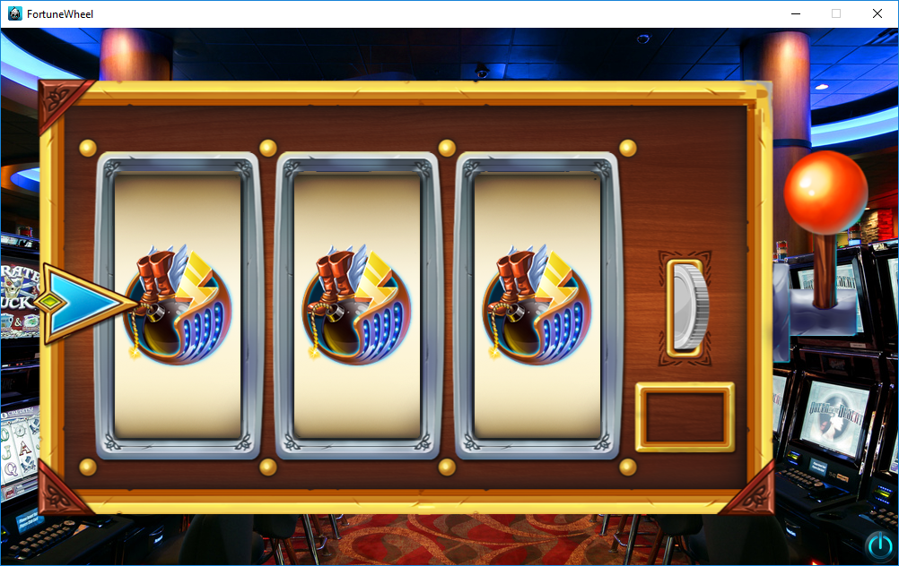
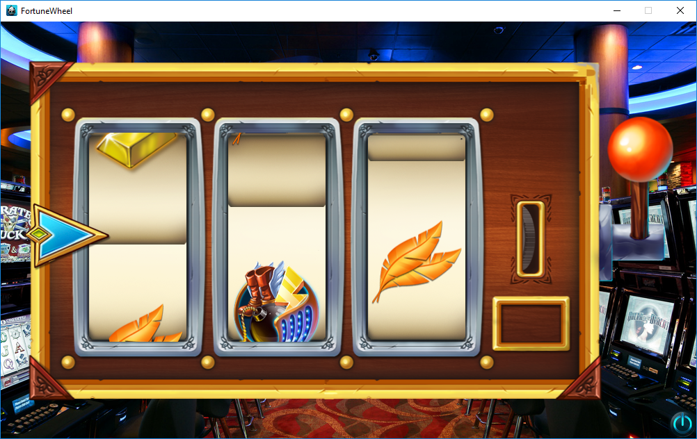
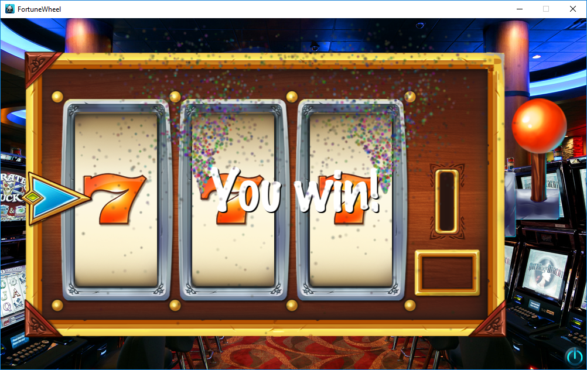

# FortuneWheel
 Zagrava Games test.
 
 ### ENG 
 Notes:
  * Every 2 roll is winning roll.
 
 You need to make a slot machine. Basic slot machine functions:
* The player must click on the slot machine handle.
* Handle must go down, token must be inserted in the draw.
* Run the slot machine
* If machine have 3 simular lines, show "You win!"
* All the necessary videos in Cocos2D on C++.
Graphic design is glued to a sheet. Runtime is 1 week (or faster).
 
### UA 
Примітки:
 * Кожен 2 ролл виграшний
 
Треба зробити слот-машину. Основні функції слот машини:
 * гравець повинен натиснути на ручку слот-машини.
 * програти анімацію візуального опускання ручки, запустити монетку у отвір.
 * запустити слот машину
 * у результаті однакової лінії, показати напис "You win!"
 * Все це необхідно виконати в Cocos2D на c++.
Графічні асети прикріплено до листа. Термін виконання – 1 тиждень (або швидше).

